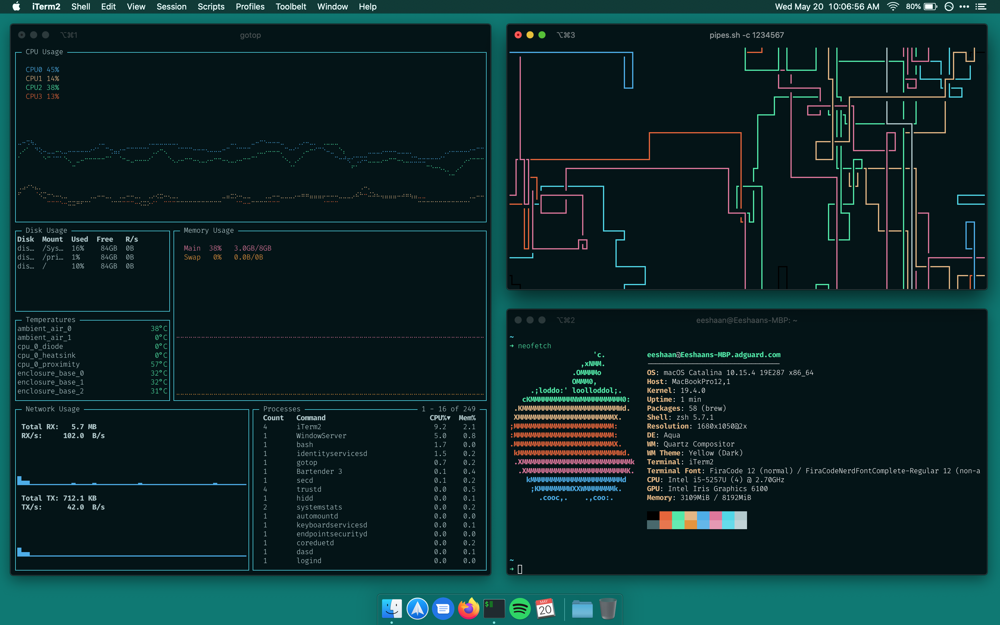
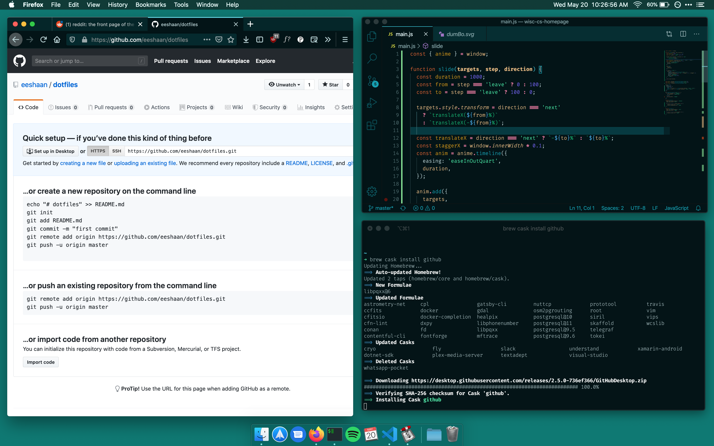

# dotfiles
my current macOS setup :)  
the antipode to [nikitavoloboev/my-mac-os](https://github.com/nikitavoloboev/my-mac-os)  
striving for minimal design and low resource intensity while still maintaining high functionality and productivity

## screens

